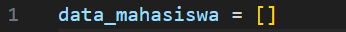
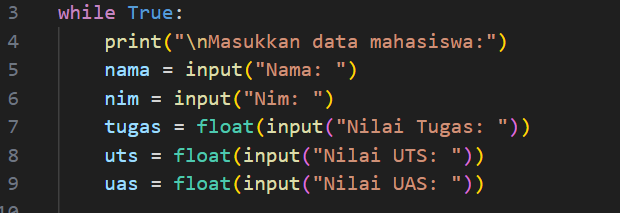
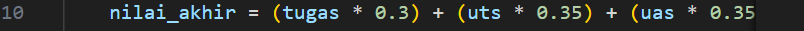
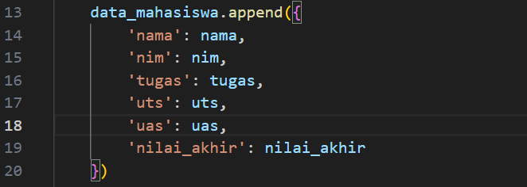
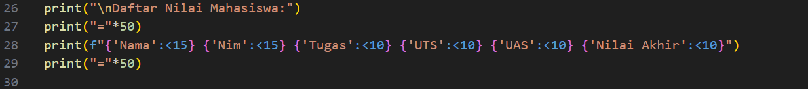
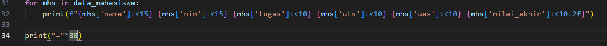
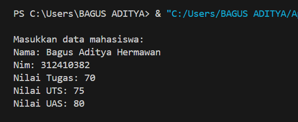
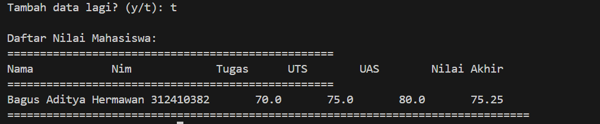

# Tugas Praktikum
## Kode Progrsm Nilai Akhir Dan Flowchartnya

## Kode Program Nilai Akhir

### Langkah 1
Analisis data mahasiswa yang berisi nama mahasiswa, nilai tugas, nilai UTS, nilai UAS, dan nilai akhir. lalu simpan pada list:

### Langkah 2
Menggunakan while untuk mengulang input data mahasiswa sampai pengguna memilih untuk berhenti.
~nama: untuk input nama mahasiswa.
~nim: program akan menginput nim mahasiswa.
~tugas: program menginput nilai tugas mahasiswa.
~uts: input nilai UTS mahasiswa yang nanti diubah dalam bentuk float.
~uas: input untuk nilai UAS diubah dalam bentuk float.:

### Langkah 3
Kemudian setelah menginput nilai tugas,UTS,dan UAS. program akan menghitung nilai akhir dengan keetentuan sebaagi berikut;
~30% untuk tugas.
~35% untuk UTS.
~35% untuk UAS.:

### Langkah 4
Data mahasiswa yang tadi diinput, akan disimpan dalam bentuk dictionary yang berisi: 'nama', 'tugas', 'uts', 'uas', dan 'nilai_akhir'. lalu akan ditambahkan kedalam list data_mahasiswa:

### Langkah 5
Setelah data dimasukkan, program akan menanyakan apakah pengguna ingin menambah data lagi dengan memberikan dua pilihan "y" untuk ya dan "t" untuk tidak. Jika pengguna memilih "t", maka program akan berhenti dan melanjutkan ke bagian berikutnya:

### Langkah 6
Program akan mencetak dan menampilkan data mahasiswa yang telah diinput. tampilan berisi nama,nim,tugas,UTS,UAS,dan nilai akhir:

### Langkah 7
program melakukan loop melalui setiap data mahasiswa yang ada di dalam data_mahasiswa. Setiap item mhs adalah dictionary yang berisi informasi tentang mahasiswa. Data ditampilkan:nama,nim,tugas,UTS,UAS,dan nilai akhir. lalu print:

### Hasil Program

## Flowchart
